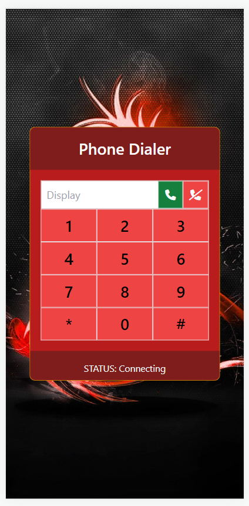

# JST-Design-Kit

My very own customized TailwindCSS Design Kit. Free for all users.

## Installation

- Clone the repository

`git clone https://github.com/sorianojerome/JST-Design-Kit.git`

## Running TailwindCSS Watcher

- During development run command below:

`npx tailwindcss -i ./src/jst-style.css -o ./dist/jst-style.css --watch`

## Components List

- [X] Login
- [ ] Navigation Bar
- [X] Background Fix Center Scrolling
- [X] Dialer

- [ ] Accordion
- [ ] Alerts
- [ ] Avatar
- [ ] Badge
- [ ] Bottom Navigation
- [ ] Breadcrumbs
- [ ] Button Groups
- [ ] Buttons
- [ ] Card
- [ ] Carousel
- [ ] Collapse
- [ ] Loading
- [ ] Progress
- [ ] Dropdown

## Screenshots

### Background Fix Center Scrolling

  

  

### Login

  

### Dialer

  

